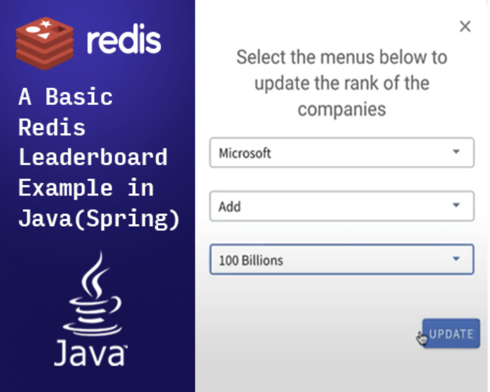

import Tabs from '@theme/Tabs';
import TabItem from '@theme/TabItem';
import useBaseUrl from '@docusaurus/useBaseUrl';
import RedisCard from '@site/src/theme/RedisCard';

Find tutorials, examples and technical articles that will help you to develop with Redis and Java.


## Getting Started

Java community has built many client libraries that you can find [here](https://redis.io/clients#java). For your first steps with Java and Redis, this article will show how to use the two main libraries: [Jedis](https://github.com/redis/jedis) and [Lettuce](https://lettuce.io/).

The blog post “[Jedis vs. Lettuce: An Exploration](https://redislabs.com/blog/jedis-vs-lettuce-an-exploration/)” will help you to select the best for your application; keeping in mind that both are available in Spring & SpringBoot framework.


<Tabs
  defaultValue="jedis"
  values={[
    {label: 'Jedis', value: 'jedis'},
    {label: 'Lettuce', value: 'lettuce'},
  ]}>
  <TabItem value="jedis">

## Using Jedis

### Step 1. Add dependencies Jedis dependency to your Maven (or Gradle) project file:

   ```xml
    <dependency>
        <groupId>redis.clients</groupId>
        <artifactId>jedis</artifactId>
        <version>3.4.0</version>
    </dependency>
   ```

### Step 2. Import the required classes

   ```java
    import redis.clients.jedis.*;
   ```


### Step 3. Create a Connection Pool

Once you have added the Jedis library to your project and imported the necessary classes you can create a connection pool.

You can find more information about Jedis connection pool in the [Jedis Wiki](https://github.com/redis/jedis/wiki/Getting-started#basic-usage-example). The connection pool is based on the [Apache Common Pool 2.0 library](http://commons.apache.org/proper/commons-pool/apidocs/org/apache/commons/pool2/impl/GenericObjectPoolConfig.html).

   ```java
     JedisPool jedisPool = new JedisPool(new JedisPoolConfig(), "localhost", 6379);
   ```


### Step 4. Write your application code

Once you have access to the connection pool you can now get a Jedis instance and start to interact with your Redis instance.

   ```java
     // Create a Jedis connection pool
     JedisPool jedisPool = new JedisPool(new JedisPoolConfig(), "localhost", 6379);

     // Get the pool and use the database
     try (Jedis jedis = jedisPool.getResource()) {

     jedis.set("mykey", "Hello from Jedis");
     String value = jedis.get("mykey");
     System.out.println( value );

     jedis.zadd("vehicles", 0, "car");
     jedis.zadd("vehicles", 0, "bike");
     Set<String> vehicles = jedis.zrange("vehicles", 0, -1);
     System.out.println( vehicles );

     }

     // close the connection pool
     jedisPool.close();
   ```

Find more information about Java & Redis connections in the "[Redis Connect](https://github.com/redis-developer/redis-connect/tree/master/java/jedis)".


  </TabItem>
  <TabItem value="lettuce">

## Using Lettuce

### Step 1. Add dependencies Jedis dependency to your Maven (or Gradle) project file:

   ```xml
    <dependency>
       <groupId>io.lettuce</groupId>
       <artifactId>lettuce-core</artifactId>a
        <version>6.0.1.RELEASE</version>
    </dependency>
   ```


### Step 2. Import the Jedis classes

   ```java
    import io.lettuce.core.RedisClient;
    import io.lettuce.core.api.StatefulRedisConnection;
    import io.lettuce.core.api.sync.RedisCommands;
   ```

### Step 3. Write your application code

   ```java
     RedisClient redisClient = RedisClient.create("redis://localhost:6379/");
     StatefulRedisConnection<String, String> connection = redisClient.connect();
     RedisCommands<String, String> syncCommands = connection.sync();

     syncCommands.set("mykey", "Hello from Lettuce!");
     String value = syncCommands.get("mykey");
     System.out.println( value );

     syncCommands.zadd("vehicles", 0, "car");
     syncCommands.zadd("vehicles", 0, "bike");
     List<String> vehicles = syncCommands.zrange("vehicles", 0, -1);
     System.out.println( vehicles );

     connection.close();
     redisClient.shutdown();
   ```


Find more information about Java & Redis connections in the "[Redis Connect](https://github.com/redis-developer/redis-connect/tree/master/java/lettuce)".
  </TabItem>
</Tabs>

### Redis Launchpad

Redis Launchpad is like an “App Store” for Redis sample apps. You can easily find apps for your preferred frameworks and languages.
Below are few of these apps. [Click here to access the complete lists of apps](https://launchpad.redis.com)

<div class="row text--center">

<div class="col ">
<div className="ri-container">

#### Movie Database app in Java


[Movie Database app in Java](http://launchpad.redis.com/?id=project%3Ademo-movie-app-redisearch-java) based on RediSearch capabilities
</div>
</div>

<div class="col">
<div className="ri-container">

#### Leaderboard app in Java



[How to implement leaderboard app](http://launchpad.redis.com/?id=project%3Abasic-redis-leaderboard-demo-java) using Redis & Java(Spring)
</div>
</div>
</div>

### Ecosystem

As developer you can use the Java client library directly in your application, or you can frameworks like: [Spring](https://spring.io/), [Quarkus](https://quarkus.io/),  [Vert.x](https://vertx.io/), and [Micronaut](https://micronaut.io/).


<div class="row text--center">

<div class="col ">
<div className="ri-container">

#### Develop with Spring


[Spring Data Redis](https://spring.io/projects/spring-data-redis), part of the larger Spring Data project. It provides easy access to Redis from Spring applications.
</div>
</div>

<div class="col">
<div className="ri-container">

#### Develop with Quarkus


[Redis Client extension](https://quarkus.io/guides/redis) allows you to connect your Quarkus application to a Redis instance.
</div>
</div>
</div>


<div class="row text--center">

<div class="col">
<div className="ri-container">

#### Develop with Vert.x


[Eclipse Vert.x](https://vertx.io/introduction-to-vertx-and-reactive/) is a framework to build reactive applications on the JVM. [Vert.x-redis](https://vertx.io/docs/vertx-redis-client/java/) is redis client to be used with Vert.x.
</div>
</div>

<div class="col">
<div className="ri-container">

#### Develop with Micronaut


[Micronaut](https://micronaut.io/) is a framework for building microservices and serverless applications. The [Micronaut Redis](https://micronaut-projects.github.io/micronaut-redis/snapshot/guide/) extension provides the integration with Redis.

</div>
</div>

</div>

---


### More developer resources

<div class="row">

<div class="col">

#### Sample Code

**[Brewdis - Product Catalog (Spring)](https://github.com/redis-developer/brewdis)**
See how to use Redis and Spring to build a product catalog with streams, hashes and RediSearch


**[Redis Stream in Action (Spring)](https://github.com/redis-developer/redis-streams-in-action)**
See how to use Spring to create multiple producer and consumers with Redis Streams


**[Rate Limiting with Vert.x](https://github.com/redis-developer/vertx-rate-limiting-redis)**
See how to use Redis Sorted Set with Vert.x to build a rate limiting service.


**[Redis Java Samples with Lettuce](https://github.com/redis-developer/vertx-rate-limiting-redis)**
Run Redis Commands from Lettuce


</div>
<div class="col col--1">
</div>

<div class="col">

#### Technical Articles

**[Getting Started with Redis Streams and Java (Lettuce)](https://redislabs.com/blog/getting-started-with-redis-streams-and-java/)**

**[Jedis vs. Lettuce: An Exploration](https://redislabs.com/blog/jedis-vs-lettuce-an-exploration/https://redislabs.com/blog/jedis-vs-lettuce-an-exploration/)**


</div>

</div>

---

### Redis University

### [Redis for Java Developers](https://university.redislabs.com/courses/ru102j/)

Redis for Java Developers teaches you how to build robust Redis client applications in Java using the Jedis client library. The course focuses on writing idiomatic Java applications with the Jedis API, describing language-specific patterns for managing Redis database connections, handling errors, and using standard classes from the JDK. The course material uses the Jedis API directly with no additional frameworks. As such, the course is appropriate for all Java developers, and it clearly illustrates the principles involved in writing applications with Redis.

<div class="text--center">
<iframe width="560" height="315" src="https://www.youtube.com/embed/CmQMdJefTjc" frameborder="0" allow="accelerometer; autoplay; clipboard-write; encrypted-media; gyroscope; picture-in-picture" allowfullscreen></iframe>
</div>

##

<div>
<a href="https://launchpad.redis.com" target="_blank" rel="noopener" className="link"> </a>
</div>
